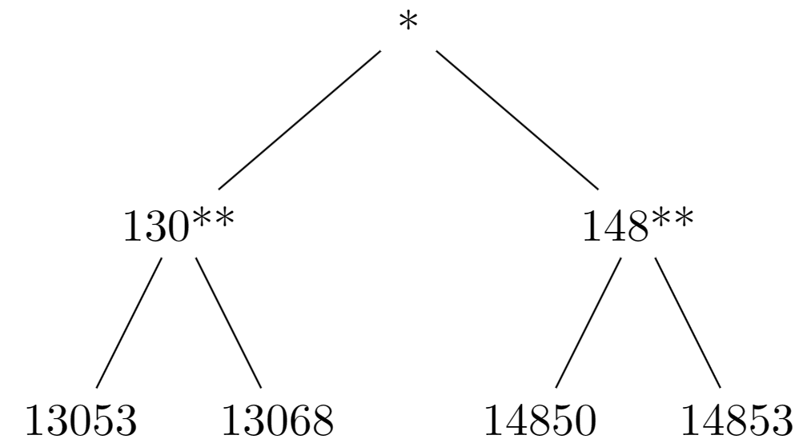
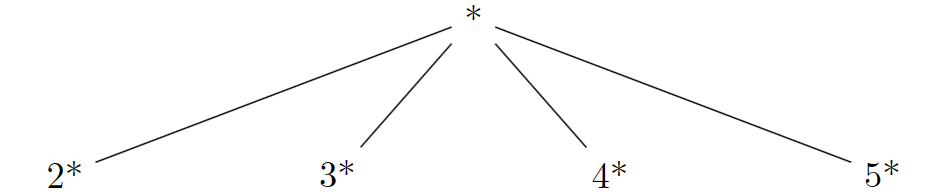
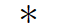
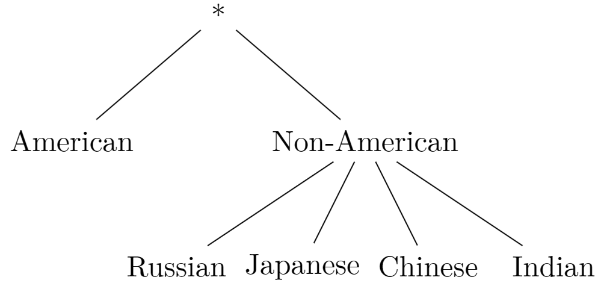
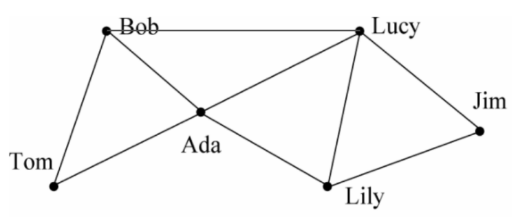
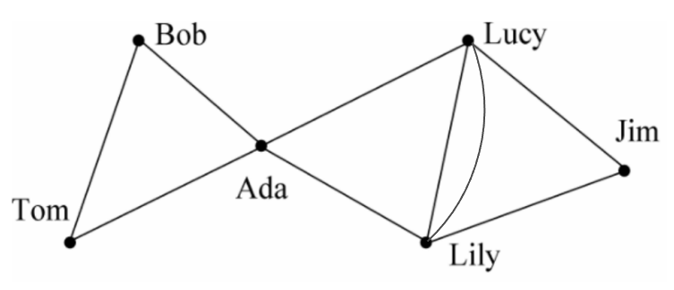

# 数据隐私HW1
**罗浩铭 PB21030838**

## 1 K-anonymity
### (a)
准标识符有：Zip Code, Age, Salary, Nationality

### (b)
画出各属性的属性泛化树如下：

Zip Code:

Age:

Salary:

Nationality:

则数据集经k匿名处理后发布出来的表为：
|  No   | Zip Code |  Age  | Salary | Nationality  |    Condition    |
| :---: | :------: | :---: | :----: | :----------: | :-------------: |
|   1   |  130**   |  2*   |   *    | Non-American |  Heart Disease  |
|   2   |  130**   |  2*   |   *    |   American   |  Heart Disease  |
|   3   |  130**   |  2*   |   *    | Non-American | Viral Infection |
|   4   |  130**   |  2*   |   *    |   American   | Viral Infection |
|   5   |  148**   |  5*   |   *    | Non-American |     Cancer      |
|   6   |  148**   |  5*   |   *    | Non-American |  Heart Disease  |
|   7   |  148**   |  4*   |   *    |   American   | Viral Infection |
|   8   |  148**   |  4*   |   *    |   American   | Viral Infection |
|   9   |  130**   |  3*   |   *    | Non-American |     Cancer      |
|  10   |  130**   |  3*   |   *    | Non-American |     Cancer      |
|  11   |  130**   |  3*   |   *    | Non-American |     Cancer      |
|  12   |  130**   |  3*   |   *    | Non-American |     Cancer      |

其中的等价类为：`{1,3},{2,4},{5,6},{7,8},{9,10,11,12}`

由此计算Loss Metric如下：
先计算每一QI的Loss Metric：
Zip Code:
叶子数共为4，则$LM_1 = \frac{8 \times \frac{1}{3} + 4 \times \frac{1}{3}}{12}=0.333$
Age:
上下界之差为34，则$LM_2 = \frac{6 \times \frac{10}{34} + 4 \times \frac{9}{34} + 2 \times \frac{5}{34}}{12}=0.260$
Salary:
上下界之差为12，则$LM_3 = 1$
Nationality:
叶子数共为5，则$LM_4 = \frac{8 \times \frac{3}{4}}{12}=0.5$

则总共的Loss Metric为：
$LM=LM_1+LM_2+LM_3+LM_4=2.093$

## 2 L-Diversity
### (a)
若要使其具有`recursive (2,2)-diversity`，则每一等价类（记其含m种敏感属性）均应该满足$r_1<2 \sum^m_{i=2} r_i$。
对三个等价类进行检验得：
- $r_1=2,r_2=1,r_3=1$，满足条件
- $r_1=2,r_2=1,r_3=1$，满足条件
- $r_1=2,r_2=1,r_3=1$，满足条件
  
因此，该数据集具有`recursive (2,2)-diversity`。

### (b)
令$f(p)=p \space ln(p) (0 \le p \le 1, f(0)=0)$
先证明$f(p)$为凸函数：
$f'(p)=ln(p)+1$
$f''(p)=\frac{1}{p} \gt 0$
则由此可得$f(p)$为凸函数

由表$T$到表$T'$的泛化过程可分解为多次将多个等价类合并为一个等价类的过程。
我们先考察一次合并过程。
设合并前的等价类为$E_1, E_2, ..., E_k$，合并后的等价类为$E'$，每一种敏感属性的标号分别为$1,2,...m$，记等价类$E_i$中包含敏感属性$j$的行数为$r_{ij}$，则合并后的等价类$E'$中包含敏感属性$j$的行数为$\sum^k_{i=1} r_{ij}$。
由表$T$满足$l$-diversity，则$\forall i, -\sum^m_{j=1} f(\frac{r_{ij}}{\sum^m_{j'=1} r_{ij'}}) \ge ln(l)$
再计算合并后的等价类的信息熵：
$$
Entropy=-\sum^m_{j=1} f(\frac{\sum^k_{i=1} r_{ij}}{\sum^m_{j'=1} \sum^k_{i'=1} r_{i'j'}})
$$
由琴生不等式:
$$
f(\frac{\sum^k_{i=1} r_{ij}}{\sum^m_{j'=1} \sum^k_{i'=1} r_{i'j'}}) 
\\= f(\sum^k_{i=1} \frac{\sum^m_{j=1} r_{ij}}{\sum^m_{j'=1} \sum^k_{i'=1} r_{i'j'}} \times \frac{r_{ij}}{\sum^m_{j=1} r_{ij}}) 
\\ \le \sum^k_{i=1} \frac{\sum^m_{j=1} r_{ij}}{\sum^m_{j'=1} \sum^k_{i'=1} r_{i'j'}} f(\frac{r_{ij}}{\sum^m_{j=1} r_{ij}})
$$
由此得到：
$$
Entropy=-\sum^m_{j=1} f(\frac{\sum^k_{i=1} r_{ij}}{\sum^m_{j'=1} \sum^k_{i'=1} r_{i'j'}})
\\ \ge -\sum^m_{j=1}\sum^k_{i=1} \frac{\sum^m_{j'=1} r_{ij'}}{\sum^m_{j'=1} \sum^k_{i'=1} r_{i'j'}} f(\frac{r_{ij}}{\sum^m_{j'=1} r_{ij'}})
\\= -\sum^k_{i=1} \frac{\sum^m_{j'=1} r_{ij'}}{\sum^m_{j'=1} \sum^k_{i'=1} r_{i'j'}} \sum^m_{j=1} f(\frac{r_{ij}}{\sum^m_{j'=1} r_{ij'}})
\\ \ge \sum^k_{i=1} \frac{\sum^m_{j'=1} r_{ij'}}{\sum^m_{j'=1} \sum^k_{i'=1} r_{i'j'}} ln(l)
\\=ln(l)
$$
则合并后的新类$E'$满足$l$-diversity的要求，也即每次合并后得到的新表符合$l$-diversity的要求。
由于表$T$满足$l$-diversity，表$T$到表$T'$的泛化过程为多次上述等价类合并过程的复合，已证明若每次合并前的表满足$l$-diversity，合并后的表也满足$l$-diversity，因此由数学归纳法得，经过多次合并后得到的表$T'$也满足$l$-diversity的要求。

## 3 T-closeness
### (a)
由于$d(v_i,v_j)=\frac{|i-j|}{m-1}$，则从$v_i$直接到$v_j$的距离（代价函数）等于从$v_i$按顺序一步步输运到$v_j$的距离之和，则我们可以将所有的多步输运分解为一步步输运的复合，因此我们只需要考虑仅包含相邻点之间输运的情况。
记一个可行的从分布P至分布Q的输运方案中，从点$v_i$到点$v_{i+1}$的输运流大小为$f_i$（可为负，表示反向输运）
则：
$$
\begin{cases}
&r_1=f_1  \\
&r_i=f_i-f_{i-1}(1 \lt i \lt m)  \\
&r_m=-f_{m-1} \\
\end{cases}
$$
由此可解得唯一的输运方案：
$$
f_i=\sum_{j=1}^{i} r_j
$$
则：
$$
D[P,Q]=\sum_{i=1}^{m-1} \frac{1}{m-1} |f_i| \\
= \frac{1}{m-1} \sum_{i=1}^{m-1} |\sum_{j=1}^{i} r_j| \\
= \frac{1}{m-1} (\sum_{i=1}^{m-1} |\sum_{j=1}^{i} r_j| + 0) \\
= \frac{1}{m-1} (\sum_{i=1}^{m-1} |\sum_{j=1}^{i} r_j| + |\sum_{j=1}^{m} r_j|)  \\
= \frac{1}{m-1} \sum_{i=1}^{m} |\sum_{j=1}^{i} r_j|
$$

### (b)
记薪水取值为`{3k,4k,5k,6k,7k,8k,9k,10k,11k}`，总表分布中每一个取值的概率为$\frac{1}{9}$
对于等价类1，其分布中`{4k,5k,6k}`每个取值的概率为$\frac{1}{3}$
则$D[P,P_1]=\frac{1}{9-1} \sum_{i=1}^{m} |\sum_{j=1}^{i} r_j|=\frac{1}{8}(\frac{1}{9} + \frac{1}{9} + \frac{3}{9} + \frac{5}{9} + \frac{4}{9} + \frac{3}{9} + \frac{2}{9} + \frac{1}{9}+ \frac{0}{9}) = \frac{5}{18}$
对于等价类2，其分布中`{3k,8k,11k}`每个取值的概率为$\frac{1}{3}$
则$D[P,P_2]=\frac{1}{9-1} \sum_{i=1}^{m} |\sum_{j=1}^{i} r_j|=\frac{1}{8}(\frac{2}{9} + \frac{1}{9} + \frac{0}{9} + \frac{1}{9} + \frac{2}{9} + \frac{0}{9} + \frac{1}{9} + \frac{2}{9}+ \frac{0}{9}) = \frac{1}{8}$
对于等价类3，其分布中`{7k,9k,10k}`每个取值的概率为$\frac{1}{3}$
则$D[P,P_3]=\frac{1}{9-1} \sum_{i=1}^{m} |\sum_{j=1}^{i} r_j|=\frac{1}{8}(\frac{1}{9} + \frac{2}{9} + \frac{3}{9} + \frac{4}{9} + \frac{2}{9} + \frac{3}{9} + \frac{1}{9} + \frac{1}{9}+ \frac{0}{9}) = \frac{17}{72}$
则最大距离为$\frac{5}{18}$，该表满足$\frac{5}{18}$-clossness

## 4 Prior and posterior
### (a)
给定$R_1(x)=0$，$x=0$的先验概率为0.01，后验概率为：
$$
P(x=0|R_1(x)=0)=\frac{P(R_1(x)=0|x=0)P(x=0)}{P(R_1(x)=0)}
\\=\frac{P(R_1(x)=0|x=0)P(x=0)}{\sum_{n=0}^{100} P(R_1(x)=0|x=n)P(x=n)}
\\=\frac{(0.3 + \frac{1}{101} \times 0.7) \times 0.01}{(0.3 + \frac{1}{101} \times 0.7) \times 0.01 + \frac{1}{101} \times 0.7 \times 0.99} \approx 0.309
$$

给定$R_3(x)=0$，$x=0$的先验概率为0.01，后验概率为：
$$
P(x=0|R_3(x)=0)=\frac{P(R_3(x)=0|x=0)P(x=0)}{P(R_3(x)=0)}
\\=\frac{P(R_3(x)=0|x=0)P(x=0)}{\sum_{n=0}^{100} P(R_3(x)=0|x=n)P(x=n)}
\\=\frac{(0.5 \times \frac{1}{21} + 0.5 \times \frac{1}{101} )\times 0.01}{(0.5 \times \frac{1}{21} + 0.5 \times \frac{1}{101} )\times (0.01+20 \times 0.0099) + 0.5 \times \frac{1}{101} \times 80 \times 0.0099} 
\\=\frac{ \frac{61}{2121} \times 0.01}{\frac{1}{202} + \frac{1}{42} \times 0.208} \approx 0.0290
$$

给定$R_2(x)=0$，$x\in [20,80]$的先验概率为$61 \times 0.0099 = 0.6039$，后验概率为：
$$
P(x\in [20,80]|R_2(x)=0)=\frac{P(R_3(x)=0|x\in [20,80])P(x\in [20,80])}{P(R_2(x)=0)}
\\=\frac{P(R_3(x)=0|x\in [20,80])P(x\in [20,80])}{\sum_{n=0}^{100} P(R_2(x)=0|x=n)P(x=n)}
\\=\frac{0}{ \frac{1}{21}  \times (0.01 + 20 \times 0.0099)} = 0
$$

### (b)
对于$R_3$函数，当$R_3(X)=0$时，对于X两种取值的先后验概率差值都最小，因此使用$R_3$函数时单条数据泄露的信息量最少，最能保护隐私，最适合使用。

## 5 k-anonymity in graphs
### (a)
我们加入了(Bob, Lucy)这条边，由此得到的度数序列为：{3,2,4,4,3,2}，满足2-匿名。

### (b)
我们加入了(Lucy, Lily)这条边（为重边），由此得到的度数序列为：{2,2,4,4,4,2}，满足3-匿名。

### (c)
两小题中，$\Delta (E, E')=8$
对于a小题，$L(G, G') = 1-\frac{\left | \Delta (E, E') \right | }{max \{ |E|, |E'| \}} = 1-\frac{8}{9}=\frac{1}{9}$
对于b小题，$L(G, G') = 1-\frac{\left | \Delta (E, E') \right | }{max \{ |E|, |E'| \}} = 1-\frac{8}{9}=\frac{1}{9}$

