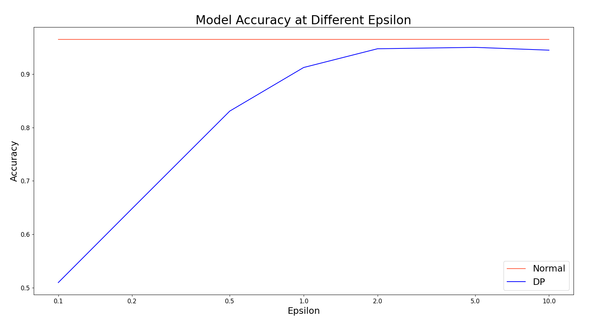
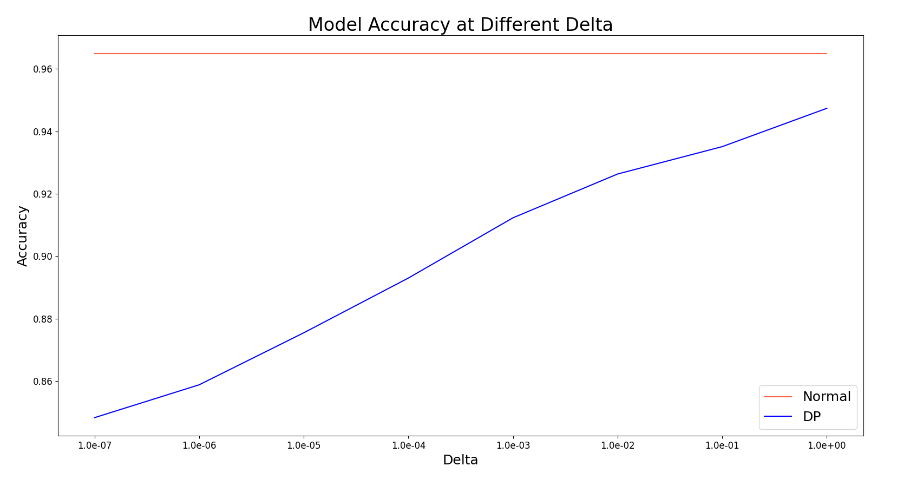
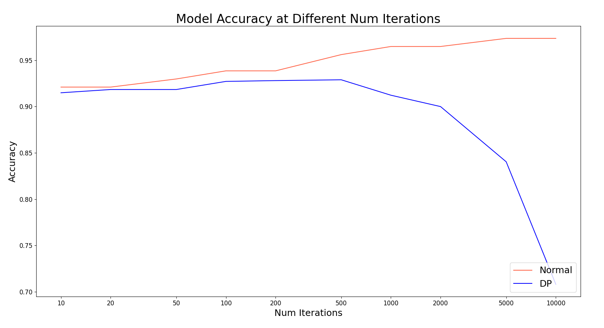
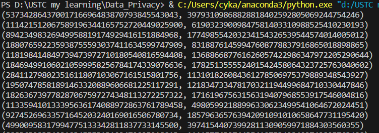
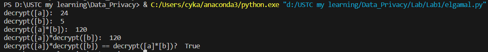
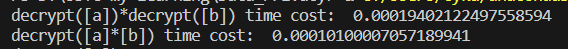

# Data_Privacy_Lab1
**罗浩铭 PB21030838**

## DP-SGD

### 代码实现
#### 实验框架debug
代码中的梯度下降公式有误，应改为如下形式（第一条公式可选择下面CrossEntropyLoss与L2Loss中的一种）：
```python
dz = -(y / (predictions + self.tau) - (1 - y) / (1 - predictions + self.tau)) # Cross entropy loss
# dz = predictions - y # L2_loss
dz = dz * (predictions * (1 - predictions)) # sigmoid derivative

dw = np.dot(X.T, dz) / num_samples
db = np.sum(dz) / num_samples
```

同时数据集的输入没有归一化，各输入特征的取值范围差异巨大（至少差4个数量级），导致训练过程中的动力学特性非常差，因此需要加入归一化。
```python
# normalize the data
X = (X - np.mean(X, axis=0)) / X.std(axis=0)
```

#### 数据集背景介绍
本次实验运行在数据集breast cancer dataset上，该数据集包含569个样本，每个样本有30个特征，表示该肿瘤各特征，每个样本都有一个标签，标签为0或1，表示该样本是否为恶性肿瘤。训练时，将其中455个样本作为训练集，114个样本作为测试集。

本次实验的目的是使用DP-SGD算法训练一个二分类器，使得该二分类器能够对新的样本进行预测，判断该样本是否为恶性肿瘤。

#### 使用Advanced Composition Theorem计算每个epoch所需隐私保证
我们使用以下方式计算在总的隐私保证要求为$\epsilon, \delta$时，每个epoch需要的隐私保证：
取$\delta = \delta'$，则计算每个epoch的隐私保证为$\epsilon_u, \delta_u$如下：
先计算$\delta_u$:
$$
\delta_u = \frac{\delta}{k + 1}
$$
由于Advanced Composition Theorem中关于$\epsilon_u$的计算公式如下：
$$
\epsilon_u = \sqrt{2k \ln(1/\delta')} \epsilon + k \epsilon (e^{\epsilon} - 1) 
$$
则由$\epsilon_u$解出$\epsilon$需要求解超越方程，我们只能对其进行近似计算：
第一步，省略方程右半部分，近似计算$\epsilon_u$的上界：
$$
\epsilon_1 = \epsilon_u / \sqrt{2k \ln(1/\delta')} 
$$
第二步，将第一步计算出的$\epsilon_1$代入方程右半部分，进行修正，由于代入的$\epsilon_1$偏大，计算所得$\epsilon_2$偏小，这将其不超过隐私预算限制：

$$
\epsilon_2 = \epsilon_u / (\sqrt{2k \ln(1/\delta')} + k (e^{\epsilon_1} - 1) )
$$

最终以$\epsilon_2$作为每个epoch的隐私保证，实测在100-10000这一epoch数范围内，该估算使得最后花费的总隐私预算与隐私预算上限的差异不超过0.2%。

```python
# 由Advanced Composition Theorem算出每个epoch需要的隐私保证
k = self.num_iterations
# epsilon_u, delta_u = epsilon / k, delta / k
delta_u = delta / (k + 1)
# 近似计算epsilon_u
# 第一步，近似计算epsilon_u，这一步的计算结果会偏大
epsilon_u = epsilon / np.sqrt(2 * k * np.log(1 / delta_u))
# 第二步，进行修正，分母中的epsilon_u大于真实的epsilon_u，因此可以保证epsilon_u的计算结果偏小，符合隐私保证
epsilon_u = epsilon / (np.sqrt(2 * k * np.log(1 / delta_u)) + k * (np.exp(epsilon_u) - 1))
```

#### 梯度裁剪
梯度裁剪用于保证每个样本数据的敏感度被限制在C以内。
这里的敏感度即为梯度的L2范数，因此我们只需要计算每个样本的梯度的L2范数，然后将其与C比较，如果大于C，则将其缩放为C，否则不变。

将以上思路向量化之后为如下代码，此处实现的是论文的原版算法：

```python
def clip_gradients(sample_gradients, C):
    # *-TODO: Clip gradients.
    grad_norm = np.linalg.norm(sample_gradients, ord=2, axis=1)
    clip_factor = np.maximum(1, grad_norm/C)
    clip_gradients = sample_gradients / clip_factor[:, np.newaxis]
    return clip_gradients
```

这里，传入的`sample_gradients`需要含有每一个样本的梯度，因此原有公式计算的梯度均值不适用，需把梯度在样本维度展开，重新计算为：`dw = X * dz.reshape(-1, 1)`。该梯度被作为函数的输入参数。

此后，计算每个样本的梯度的L2范数；然后，用`np.maximum(1, grad_norm/C)`来将确定是否缩放梯度与缩放系数大小的过程向量化，若`grad_norm`比C大，则缩放系数为`grad_norm/C`，使得缩放后梯度范数为C，否则无需缩放，缩放系数为1；最后将梯度与缩放系数相除（这里numpy的广播机制保证除法可以正确进行），得到裁剪后的梯度。

#### 添加高斯噪声
此处实现的是论文的原版算法：
```python
def add_gaussian_noise_to_gradients(sample_gradients, epsilon, delta, C):
    # *-TODO: add gaussian noise to gradients.
    gradients = np.mean(sample_gradients, axis=0)

    std = C * np.sqrt(2 * np.log(1.25 / delta)) / epsilon # 上述梯度裁剪已经保证了C即为sensitivity的上界
    noise = np.random.normal(loc=0.0, scale=std, size=gradients.shape) / sample_gradients.shape[0]
    noisy_gradients = gradients + noise
    return noisy_gradients
```

首先，将上一步得到的每个样本的梯度求平均得到未加噪的梯度。
然后以`epsilon, delta`以及敏感度`C`计算高斯噪声的标准差，生成高斯噪声，除以样本数量来缩放后，加到原来的梯度上。


### 实验结果
baseline的参数如下：

|      参数      |                   值                    |
| :------------: | :-------------------------------------: |
| num_iterations |                  1000                   |
|    epsilon     |                   1.0                   |
|     delta      |                  1e-3                   |
| learning_rate  |                  0.01                   |
|  random_seed   | 0-9（每组实验由这十个种子的结果取平均） |

以下每组实验将在baseline的基础仅修改一个来进行。

#### 不同差分隐私预算对于模型效果的影响
本组实验保证其它参数不变，且每个实验仅修改一个参数。每组参数的实验结果都由十个种子产生的结果取平均得到。

在取epsilon为`[0.1, 0.2, 0.5, 1, 2, 5, 10]`中的数时，Normal和DP-SGD的准确率测试结果如下：



注：图像的x轴坐标已经过对数变换。

可以看到，在epsilon较小时，DP-SGD的准确率相较Normal降低不少，但随着epsilon的增大，DP-SGD的准确率逐渐贴近Normal。这是因为epsilon越大，隐私限制越宽松，梯度噪声越小，DP-SGD训练过程中的梯度越接近Normal。

在取delta为`[1e-0, 1e-1, 1e-2, 1e-3, 1e-4, 1e-5, 1e-6, 1e-7]`中的数时，Normal和DP-SGD的准确率测试结果如下：



注：图像的x轴坐标已经过对数变换。

可以看到，在delta较小时，DP-SGD的准确率相较Normal降低不少，但随着delta的增大，DP-SGD的准确率逐渐贴近Normal。这是因为delta越大，隐私限制越宽松，梯度噪声越小，DP-SGD训练过程中的梯度越接近Normal。


#### 不同的迭代轮数对于模型效果的影响
本组实验保证其它参数不变，也即保证相同的总隐私消耗量。每组参数的实验结果都由十个种子产生的结果取平均得到。

在取num_iterations为`[10, 20, 50, 100, 200, 500, 1000, 2000, 5000, 10000]`中的数时，Normal和DP-SGD的准确率测试结果如下：



注：图像的x轴坐标已经过对数变换。

可以看到，随着迭代轮数的增加，Normal的准确率逐渐上升，但DP-SGD的准确率先上升后再大幅下降。这是因为低迭代次数时，欠拟合占影响准确率的主导因素，因此随着迭代轮数的增加，其性能可稍微提高；而在高迭代次数时，梯度噪声成为影响准确率的主导因素，DP-SGD每轮获取的梯度被分配到的隐私预算越低，梯度噪声也会增加，导致模型的准确率下降。总的来说，随着迭代轮数的增加，DP-SGD的准确率和Normal相差越来越大。


## Elgamal

### 代码实现
#### 快速幂工具函数
由于Elgamal算法中需要进行大数的取模意义下的快速幂运算，因此我们需要实现一个快速幂工具函数，用于计算大数在取模意义下的快速幂。

```python
def mod_exp(base, exponent, modulus):
    """*-TODO: calculate (base^exponent) mod modulus. 
        Recommend to use the fast power algorithm.
    """
    result = 1 # base^0 mod modulus = 1
    # 下面的操作是，从右到左取出exponent的每一位，如果该位为1，则将base^(2^i)乘（取模意义下）入到结果中
    # base^(2^i)以动态规划方法给出
    # 该算法使用了位运算优化，exponent & 1指取出exponent的最低位，exponent >>= 1指准备取exponent的下一位
    while exponent > 0:
        if exponent & 1:
            result = (result * base) % modulus
        base = (base * base) % modulus
        exponent >>= 1
    return result
```

该算法的基本思想是：初始化result为`base^0 mod modulus = 1`，此后从右到左取出exponent的每一位，如果该位为1，则将base^(2^i)乘（取模意义下）入到result中。

算法进行了优化：base^(2^i)以动态规划方法给出，每一轮只需以上一次的结果base^(2^(i-1))在取模意义下计算平方即可；该算法使用了位运算优化，exponent & 1指取出exponent的最低位，exponent >>= 1指准备取exponent的下一位，这将使程序的运行加快。

#### 第一阶段：密钥生成
首先调用函数`generate_p_and_g`生成大素数p及其原根g，然后调用函数`generate_keys`生成公钥和私钥。此处对`generate_p_and_g`函数进行了优化，使之避免了时间开销极端巨大的质因数分解操作，这将在实验报告后面优化部分详述。
然后，使用`random.randint`随机生成一个1至p-2的数作为私钥x，以此计算公钥$y = g^x \ mod \ p$，最后返回公钥$(p, g, y)$和私钥$x$。

实现如下：
```python
def elgamal_key_generation(key_size):
    """Generate the keys based on the key_size.
    """
    # generate a large prime number p and a primitive root g
    p, g = generate_p_and_g(key_size)

    # 随机选择一个私钥x，1<=x<=p-2
    x = random.randint(1, p-2)
    # 计算公钥y
    y = mod_exp(g, x, p)

    return (p, g, y), x
```

#### 第二阶段：加密
根据Elgamal算法，
此处使用`random.randint`随机生成一个1至p-2的数作为临时私钥k，以此计算临时公钥$c_1 = g^k \ mod \ p$，以及密文$c_2 = m \cdot y^k \ mod \ p$，其中m为明文。

实现如下：
```python
def elgamal_encrypt(public_key, plaintext):
    """ encrypt the plaintext with the public key.
    """
    p, g, y = public_key
    # 随机选择一个临时密钥k，1<=k<=p-2
    k = random.randint(1, p-2)
    # 计算临时公钥c1
    c1 = mod_exp(g, k, p)
    # 计算密文c2
    c2 = (mod_exp(y, k, p) * plaintext) % p
    return c1, c2
```


#### 第三阶段：解密
根据Elgamal算法，解密方式为：利用私钥x计算临时公钥$c_1$的模反演$s = c_1^x \ mod \ p$，然后利用$s$计算明文$m$，由$c_2 \cdot s^{-1} \ mod \ p$得到明文。
模逆元的计算使用了sympy库中的`sympy.mod_inverse`函数。

实现如下：
```python
def elgamal_decrypt(public_key, private_key, ciphertext):
    """ decrypt the ciphertext with the public key and the private key.
    """
    p, g, y = public_key
    c1, c2 = ciphertext
    # 利用私钥x计算临时公钥c1的模反演s
    s = mod_exp(c1, private_key, p)
    # 利用s计算明文
    s_inverted = sympy.mod_inverse(s, p) # 求s的逆元
    plaintext = (c2 * s_inverted) % p
    return plaintext
```


### 测试三阶段时间开销
对key_size为64、128、256、512、1024的密钥进行测试，重复次数分别为1000、100、10、3、1，每轮重复测试的结果取平均值作为最终结果。

测试结果如下：
| key_size | stage-1 time (ms) | stage-2 time (ms) | stage-3 time (ms) |
| :------: | :---------------: | :---------------: | :---------------: |
|    64    |       5.74        |       0.049       |       0.040       |
|   128    |       36.93       |       0.132       |       0.095       |
|   256    |      431.81       |       0.698       |       0.300       |
|   512    |      6826.95      |       1.928       |       1.001       |
|   1024   |     119515.77     |       9.002       |       5.000       |


### 验证 ElGamal 算法的随机性以及乘法同态性质

#### 验证 ElGamal 算法的随机性
对比同一明文加密多次的密文，验证其是否随机。

我们以明文为123456，密钥长度为128，重复加密多次，得到的密文如下：



可以发现每次的密文都不一样，因此ElGamal算法具有随机性。


#### 验证 ElGamal 算法的乘法同态性质
对a=5和b=24在同一公私钥下加密，得到密文`[a], [b]`，

分别计算`decrypt([a])*decrypt([b])`与`decrypt([a]*[b])`的结果（其中`[a]*[b]`是将二者的临时公钥在取模意义下相乘得到新的临时公钥，将二者的密文在取模意义下相乘得到新的密文），得到的结果均为120，则ElGamal算法的乘法同态性质得到验证。




decrypt([a])*decrypt([b]) time cost:  0.00019402122497558594
decrypt([a]*[b]) time cost:  0.00010100007057189941

测试1000次取平均，得到`decrypt([a])*decrypt([b])`耗时为0.194ms，`decrypt([a]*[b])`耗时为0.101ms，`decrypt([a])*decrypt([b])`耗时约为`decrypt([a]*[b])`的两倍，这可能是因为`decrypt([a])*decrypt([b])`需要两次高开销的解密操作，而`decrypt([a]*[b])`仅需一次高开销的解密操作，因此存在两倍的耗时差。




### 优化 ElGamal 算法加解密的时间开销

#### 优化大素数与原根生成的算法

原有的大素数与原根算法中，需要生成大素数p，并知道p-1的质因数列表，用以判断g是否为p的原根：

原有的算法中，是先生成p，然后对p-1进行质因数分解，这将导致时间开销极端巨大，对于位数n复杂度为$O(2^{\frac{n}{2}})$。
```python
# generate an n-bit random prime number p
p = sympy.randprime(2**(n_bit-1), 2**n_bit)

# compute the prime factorization of p-1
factors = sympy.factorint(p-1).keys()
```

我们可以对该算法改为：随机选取n-1位的素数q，直到满足p=2q+1也是素数，我们采纳这样的p，这样p-1的质因数分解结果就是2*q。该算法避免了质因数分解，因此时间开销大大降低。

其实现如下：
```python
# 我们随机选取一个素数q，然后满足p=2q+1也是素数，这样p-1的质因数分解结果就是2*q
finded = False
while not finded:
    q = sympy.randprime(2**(n_bit-2), 2**(n_bit-1)) # 生成一个n_bit-1位的素数q，这可以保证p位数是n_bit
    p = 2 * q + 1
    finded = sympy.isprime(p)
    
# compute the prime factorization of p-1
factors = [2, q]
```

优化前后，第一阶段密钥生成的时间开销对比如下：
| key_size | 优化前(ms) | 优化后(ms) |
| :------: | :--------: | :--------: |
|    64    |    7.97    |    5.74    |
|   128    |  1868.80   |   36.93    |
|   256    | 102292.40  |   431.81   |
|   512    |  用时过长  |  6826.95   |
|   1024   |  用时过长  | 119515.77  |


#### 批量加密和解密
我们可以利用同一对公私钥，对多个明文进行加密，或对多个密文进行解密，这样可以减少密钥生成的时间开销。


```python
def main_encrypt_batch(key_size, plaintext_list):
    # generate keys
    public_key, private_key = elgamal_key_generation(key_size)
    ciphertext_list = []
    for plaintext in plaintext_list:
        # encrypt plaintext
        ciphertext = elgamal_encrypt(public_key, plaintext)
        ciphertext_list.append(ciphertext)
    decrypted_text_list = []
    for ciphertext in ciphertext_list:
        # decrypt ciphertext
        decrypted_text = elgamal_decrypt(public_key, private_key, ciphertext)
        decrypted_text_list.append(decrypted_text)
    return ciphertext_list, decrypted_text_list
```

令密文长度为1000，测得的平均每个密文用时如下：
| key_size | 优化前(ms) | 优化后(ms) |
| :------: | :--------: | :--------: |
|    64    |    6.24    |   0.097    |
|   128    |   47.52    |   0.350    |
|   256    |   463.81   |   0.851    |

可以看到，优化后的算法在密文长度为1000时，密钥生成的时间开销大幅降低。

